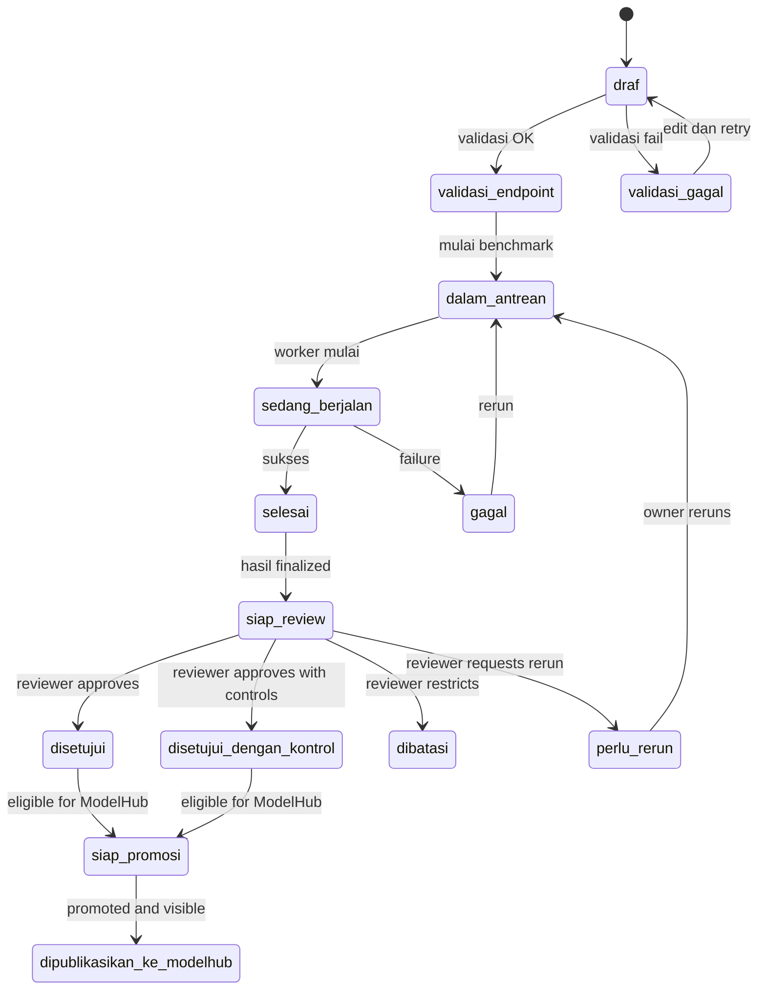

# AI Sandbox & ModelHub - Frontend Implementation Guide v5.0

> **Purpose**: Complete frontend guide aligned with product split (AI Sandbox + ModelHub)
> **Version**: 5.0 (Product Alignment Update)
> **Last Updated**: March 11, 2026
> **Priority**: **CRITICAL** - Product architecture change

---

## 🎯 Executive Summary

### Major Product Split

**Two distinct surfaces:**

| Surface | Audience | Purpose | Routes |
|---------|----------|---------|--------|
| **AI Sandbox** | Model Owner, Admin/Reviewer | Internal testing & review | `/dashboard`, `/models`, `/reviews` |
| **ModelHub** | Developer, Use Case Owner | Leaderboard & discovery | `/`, `/ranking`, `/models/[id]/public` |

**Key Changes:**
1. ✅ "Publish" is now "Promote to ModelHub" (gate, not toggle)
2. ✅ Builder/Public journeys moved to ModelHub
3. ✅ LiteLLM, background runs, history, version comparison are **required**
4. ✅ Indonesian-first labels
5. ✅ Separate internal review from external discovery

---

## 📋 Product Architecture

### AI Sandbox (Internal Workspace)

**Users:**
- `Model Owner` / `Model Vendor`
- `Admin / Reviewer`

**Purpose:**
- Register model
- Validate endpoint (via LiteLLM)
- Run benchmark (background)
- Inspect scorecard
- Review evidence
- Decide promotion eligibility

**Core Routes:**
```
/dashboard          - Admin dashboard
/models             - Model list (owner workspace)
/models/new         - Add model
/models/[id]        - Model detail
/models/[id]/runs/[runId] - Run detail
/reviews            - Review queue
/reviews/[id]       - Review detail
```

### ModelHub (Discovery Surface)

**Users:**
- `Developer`
- `Use Case Owner`
- `Product Owner`
- Public viewers (where allowed)

**Purpose:**
- Leaderboard
- Model profile
- Comparison
- Pricing & documentation
- Trust summary from Sandbox

**Core Routes:**
```
/                   - Landing page
/ranking            - Leaderboard
/ranking/compare    - Comparison
/models/[id]/public - Public profile
```

---

## 1. Navigation & Menu Structure

### 🚨 CRITICAL: Separate Sandbox & ModelHub Navigation

**AI Sandbox Sidebar (Internal):**
```tsx
<NavGroup label="Utama">
  <NavItem icon="LayoutDashboard" label="Dashboard" href="/dashboard" />
  <NavItem icon="Layers" label="Model Saya" href="/models" />
  <NavItem icon="Play" label="Pengujian" href="/runs" />
</NavGroup>

<NavGroup label="Operasional">
  <NavItem icon="ClipboardList" label="Riwayat" href="/history" />
  <NavItem icon="Eye" label="Review" href="/reviews" />  {/* Admin only */}
</NavGroup>
```

**ModelHub Navigation (Public):**
```tsx
<PublicNavbar>
  <NavLink href="/">Beranda</NavLink>
  <NavLink href="/ranking">Peringkat</NavLink>
  <NavLink href="/login">Masuk</NavLink>
</PublicNavbar>
```

**Menu Items (Exact Names):**

| Surface | Menu | Icon | Route | Audience |
|---------|------|------|-------|----------|
| **AI Sandbox** | Dashboard | LayoutDashboard | `/dashboard` | Admin |
| **AI Sandbox** | Model Saya | Layers | `/models` | Owner |
| **AI Sandbox** | Pengujian | Play | `/runs` | All |
| **AI Sandbox** | Riwayat | ClipboardList | `/history` | All |
| **AI Sandbox** | Review | Eye | `/reviews` | Admin only |
| **ModelHub** | Beranda | Home | `/` | Public |
| **ModelHub** | Peringkat | Trophy | `/ranking` | Public |

**Files to Modify:**
| File | Change | Priority |
|------|--------|----------|
| `03_Frontend/src/components/layout/Sidebar.tsx` | Update to Sandbox nav | **CRITICAL** |
| `03_Frontend/src/components/layout/PublicNavbar.tsx` | ModelHub nav | **CRITICAL** |
| `03_Frontend/src/app/[locale]/layout.tsx` | Route group separation | **HIGH** |

**QA Checklist:**
- [ ] Sandbox has internal navigation
- [ ] ModelHub has public navigation
- [ ] No "Review Queue" in ModelHub
- [ ] No "Peringkat" in Sandbox sidebar
- [ ] Correct icons for each menu

---

## 2. Language Standardization

### 🟠 HIGH: Indonesian-First Labels

**Required Standard:**

### Navigation & Menus
| English | Indonesian (Use This) |
|---------|----------------------|
| Dashboard | Dashboard |
| My Models | Model Saya |
| Runs | Pengujian |
| History | Riwayat |
| Review | Review |
| Leaderboard | Peringkat |
| Home | Beranda |
| Login | Masuk |
| Logout | Keluar |
| Settings | Pengaturan |

### Actions
| English | Indonesian (Use This) |
|---------|----------------------|
| Add Model | Tambah Model |
| Save | Simpan |
| Cancel | Batal |
| Continue | Lanjutkan |
| Back | Kembali |
| Submit for Review | Ajukan untuk Review |
| Promote to ModelHub | Promosikan ke ModelHub |
| Rerun | Jalankan Ulang |
| Run Benchmark | Jalankan Benchmark |
| View Details | Lihat Detail |
| Compare | Bandingkan |

### Status Labels
| Status | Indonesian (Use This) |
|--------|----------------------|
| `draft` | Draf |
| `validation_pending` | Validasi Endpoint |
| `endpoint_valid` | Endpoint Valid |
| `run_in_progress` | Sedang Berjalan |
| `assessment_completed` | Selesai |
| `review_ready` | Siap Review |
| `approved` | Disetujui |
| `approved_with_controls` | Disetujui dengan Kontrol |
| `restricted` | Dibatasi |
| `promotion_ready` | Siap Promosi |
| `published_to_modelhub` | Dipublikasikan ke ModelHub |

### Metrics
| English | Indonesian (Use This) |
|---------|----------------------|
| Total Models | Total Model |
| Testing Running | Testing Berjalan |
| Testing Completed | Testing Selesai |
| Ready for Review | Siap Review |
| Promoted to ModelHub | Dipromosikan ke ModelHub |

**Files to Modify:**
| File | Change | Priority |
|------|--------|----------|
| `03_Frontend/src/messages/id.json` | Update all translations | **HIGH** |
| All pages | Replace hardcoded strings | **HIGH** |

**QA Checklist:**
- [ ] All navigation in Indonesian
- [ ] All buttons in Indonesian
- [ ] All status labels in Indonesian
- [ ] All metrics in Indonesian

---

## 3. State Machine & Status Rendering

### 🚨 CRITICAL: Correct Status Flow

**Required State Machine:**



**Status Badge Colors:**

| Status | Color | Hex | Badge Variant |
|--------|-------|-----|---------------|
| `draft` | Gray | `#6B7280` | neutral |
| `validation_pending` | Amber | `#f59e0b` | warning |
| `endpoint_valid` | Teal | `#10b981` | success |
| `run_in_progress` | Blue | `#1545BC` | info (pulse) |
| `assessment_completed` | Green | `#059669` | success |
| `review_ready` | Amber | `#f59e0b` | warning |
| `approved` | Green | `#10b981` | success |
| `approved_with_controls` | Lime | `#84CC16` | success |
| `restricted` | Orange | `#F97316` | warning |
| `promotion_ready` | Blue | `#1545BC` | info |
| `published_to_modelhub` | Green | `#059669` | success |

**Implementation:**
```tsx
// StatusBadge component
const statusConfig = {
  draft: { color: '#6B7280', label: 'Draf', variant: 'neutral' },
  validation_pending: { color: '#f59e0b', label: 'Validasi Endpoint', variant: 'warning' },
  endpoint_valid: { color: '#10b981', label: 'Endpoint Valid', variant: 'success' },
  run_in_progress: { color: '#1545BC', label: 'Sedang Berjalan', variant: 'info', pulse: true },
  assessment_completed: { color: '#059669', label: 'Selesai', variant: 'success' },
  review_ready: { color: '#f59e0b', label: 'Siap Review', variant: 'warning' },
  approved: { color: '#10b981', label: 'Disetujui', variant: 'success' },
  promotion_ready: { color: '#1545BC', label: 'Siap Promosi', variant: 'info' },
  published_to_modelhub: { color: '#059669', label: 'Dipublikasikan ke ModelHub', variant: 'success' },
};
```

**Files to Modify:**
| File | Change | Priority |
|------|--------|----------|
| `03_Frontend/src/lib/statusConfig.ts` | Update status flow | **CRITICAL** |
| `03_Frontend/src/components/shared/StatusBadge.tsx` | Update colors | **CRITICAL** |
| All pages | Use correct status labels | **HIGH** |

**QA Checklist:**
- [ ] Status flow matches diagram
- [ ] Correct colors for each status
- [ ] Indonesian labels
- [ ] Pulse animation for `run_in_progress`
- [ ] No "published" without "to_modelhub" distinction

---

## 4. Model List (AI Sandbox)

### 🚨 CRITICAL: Status Column Must Show Data

**Required Implementation:**

```tsx
// Model list table
<Table>
  <thead>
    <tr>
      <th>Nama Model</th>
      <th>Provider</th>
      <th>Status</th>
      <th>Terakhir Run</th>
      <th>Aksi</th>
    </tr>
  </thead>
  <tbody>
    {models.map(model => (
      <TableRow key={model.id}>
        <td>{model.name}</td>
        <td>{model.provider}</td>
        <td>
          <StatusBadge status={model.status} />
        </td>
        <td>
          {model.lastRun ? formatDate(model.lastRun) : '-'}
        </td>
        <td>
          {/* Show appropriate action based on status */}
          {model.status === 'assessment_completed' && (
            <Button variant="outline" size="sm">
              Detail Testing
            </Button>
          )}
          {model.status === 'review_ready' && (
            <Badge variant="warning">Menunggu Review</Badge>
          )}
          {model.status === 'promotion_ready' && (
            <Badge variant="info">Siap Promosi</Badge>
          )}
          {model.status === 'published_to_modelhub' && (
            <Button variant="outline" size="sm">
              Lihat di ModelHub
            </Button>
          )}
        </td>
      </TableRow>
    ))}
  </tbody>
</Table>
```

**Files to Modify:**
| File | Change | Priority |
|------|--------|----------|
| `03_Frontend/src/app/[locale]/(internal)/models/page.tsx` | Populate status column | **CRITICAL** |

**QA Checklist:**
- [ ] Status visible for every model
- [ ] Correct action buttons per status
- [ ] "Lihat di ModelHub" for published models
- [ ] No empty status cells

---

## 5. Benchmark Execution

### 🟠 HIGH: Background Runs with History

**Required Features:**

1. **Background Execution**
   - Run continues after navigation
   - Persist in localStorage/database
   - Global progress indicator

2. **Version History**
   - Track all runs per model
   - Enable version comparison
   - Show run metadata

**Implementation:**
```tsx
// Start benchmark (background)
const handleStartBenchmark = async (packageId: string) => {
  const run = await api.startRun({ modelId, packageId });
  
  // Store in localStorage for persistence
  localStorage.setItem('activeBenchmark', JSON.stringify({
    runId: run.id,
    modelId,
    startTime: Date.now(),
    estimatedCompletion: Date.now() + (run.estimatedMinutes * 60000)
  }));
  
  // Navigate away - run continues in background
  router.push('/models');
};

// Global progress indicator (in Sidebar)
{activeBenchmark && (
  <div className="global-progress">
    <Spinner size="sm" />
    <span>Benchmark berjalan... ({progress}%)</span>
  </div>
)}

// Version history tab
<Tabs defaultValue="history">
  <TabList>
    <Tab value="history">Riwayat Benchmark</Tab>
    <Tab value="comparison">Bandingkan Versi</Tab>
  </TabList>
  
  <TabPanel value="history">
    <RunHistoryList runs={availableRuns} />
  </TabPanel>
  
  <TabPanel value="comparison">
    <VersionComparisonView runs={availableRuns} />
  </TabPanel>
</Tabs>
```

**Files to Modify:**
| File | Change | Priority |
|------|--------|----------|
| `03_Frontend/src/components/run/BenchmarkWizard.tsx` | Background execution | **HIGH** |
| `03_Frontend/src/components/layout/Sidebar.tsx` | Global progress | **HIGH** |
| `03_Frontend/src/app/[locale]/(internal)/models/[id]/page.tsx` | History & comparison tabs | **HIGH** |

**QA Checklist:**
- [ ] Run continues after navigation
- [ ] Progress visible in sidebar
- [ ] History tab shows all runs
- [ ] Comparison tab works
- [ ] Can compare 2+ versions

---

## 6. Package Detail Modal

### 🟠 HIGH: Make "?" Icon Clickable

**Required Implementation:**

```tsx
// Package selection with clickable info
<div className="package-item">
  <div className="package-header">
    <div className="package-info">
      <h3>{package.name}</h3>
      <p>{package.description}</p>
      <div className="meta">
        <span>{package.tests} tests</span>
        <span>~{package.estimatedTime}</span>
      </div>
    </div>
    
    {/* Clickable info icon */}
    <button 
      className="info-button"
      onClick={() => openPackageDetail(package.id)}
      style={{ cursor: 'pointer' }}
    >
      <HelpCircle size={20} />
    </button>
  </div>
</div>

// Package Detail Modal
<Modal isOpen={selectedPackage !== null} onClose={onClose}>
  <ModalHeader>
    <h3>{selectedPackage?.name} - Detail Testing</h3>
  </ModalHeader>
  <ModalBody>
    <h4>Akan diuji:</h4>
    <ul>
      <li>Prompt Injection (OWASP LLM01)</li>
      <li>Data Leakage (OWASP LLM06)</li>
      <li>Bias Detection (ISO/IEC 42001 A.5)</li>
      <li>Jailbreak Attempts</li>
      <li>PII Disclosure</li>
    </ul>
    
    <h4>Metode Testing:</h4>
    <p>{selectedPackage?.methodology}</p>
    
    <h4>Estimasi Waktu:</h4>
    <p>{selectedPackage?.estimatedTime}</p>
    
    <h4>Output:</h4>
    <ul>
      <li>Skor per kategori</li>
      <li>Temuan dengan severity</li>
      <li>Bukti (prompt + response)</li>
      <li>Rekomendasi mitigasi</li>
    </ul>
  </ModalBody>
  <ModalFooter>
    <Button onClick={onClose}>Tutup</Button>
  </ModalFooter>
</Modal>
```

**Files to Modify:**
| File | Change | Priority |
|------|--------|----------|
| `03_Frontend/src/components/run/BenchmarkWizard.tsx` | Make "?" clickable | **HIGH** |
| `03_Frontend/src/components/run/PackageDetailModal.tsx` | Create modal | **HIGH** |

**QA Checklist:**
- [ ] "?" has pointer cursor
- [ ] Click opens modal
- [ ] Modal shows test details
- [ ] Modal shows methodology
- [ ] Modal shows expected output

---

## 7. Promotion Gate (Not Toggle)

### 🚨 CRITICAL: Publish is Promotion to ModelHub

**Required Flow:**

```tsx
// After review approval
const handlePromotion = async () => {
  // Check if model is eligible (score >= 60, i.e., A/B/C)
  if (overallScore < 60) {
    toast.error('Model dengan nilai D atau E tidak dapat dipromosikan');
    return;
  }
  
  // Mark as promotion_ready
  await api.updateModelStatus(modelId, 'promotion_ready');
  
  // Confirm promotion
  const confirmed = await confirmPromotion();
  if (confirmed) {
    await api.promoteToModelHub(modelId);
    toast.success('Model berhasil dipromosikan ke ModelHub');
    router.push('/ranking?view=promoted');
  }
};

// Promotion button
<Button 
  variant="primary"
  disabled={!canPromote || overallScore < 60}
  onClick={handlePromotion}
>
  Promosikan ke ModelHub
</Button>

{overallScore < 60 && (
  <Alert variant="warning">
    Model dengan skor di bawah 60 (nilai D atau E) tidak dapat dipromosikan
    ke ModelHub karena risiko kepatuhan yang tinggi.
  </Alert>
)}
```

**Files to Modify:**
| File | Change | Priority |
|------|--------|----------|
| `03_Frontend/src/app/[locale]/(internal)/models/[id]/runs/[runId]/page.tsx` | Add promotion flow | **CRITICAL** |
| `03_Frontend/src/components/review/DecisionDrawer.tsx` | Update decision options | **HIGH** |

**QA Checklist:**
- [ ] "Promosikan ke ModelHub" button (not "Publish")
- [ ] Score guard (≥ 60 required)
- [ ] Warning for low scores
- [ ] Redirects to ModelHub ranking
- [ ] Status updates to `published_to_modelhub`

---

## 8. Mobile Navigation

### 🟠 HIGH: Hamburger Menu

**Required Implementation:**

```tsx
// PublicNavbar with hamburger
<div className="navbar">
  <div className="navbar-brand">
    <Logo />
    <span className="product-name">AI Sandbox</span>
  </div>
  
  {/* Desktop nav */}
  <div className="navbar-links desktop-only">
    <NavLink href="/">Beranda</NavLink>
    <NavLink href="/ranking">Peringkat</NavLink>
    <NavLink href="/login">Masuk</NavLink>
  </div>
  
  {/* Mobile hamburger */}
  <button 
    className="hamburger mobile-only"
    onClick={() => setMobileMenuOpen(!mobileMenuOpen)}
  >
    {mobileMenuOpen ? <X /> : <Menu />}
  </button>
  
  {/* Mobile menu overlay */}
  {mobileMenuOpen && (
    <div className="mobile-menu-overlay">
      <div className="mobile-menu">
        <NavLink href="/" onClick={() => setMobileMenuOpen(false)}>Beranda</NavLink>
        <NavLink href="/ranking" onClick={() => setMobileMenuOpen(false)}>Peringkat</NavLink>
        <NavLink href="/login" onClick={() => setMobileMenuOpen(false)}>Masuk</NavLink>
      </div>
    </div>
  )}
</div>
```

**Files to Modify:**
| File | Change | Priority |
|------|--------|----------|
| `03_Frontend/src/components/layout/PublicNavbar.tsx` | Add hamburger | **HIGH** |
| `03_Frontend/src/components/layout/NavbarMinimal.tsx` | Add hamburger | **HIGH** |
| `03_Frontend/src/styles/globals.css` | Mobile styles | **HIGH** |

**QA Checklist:**
- [ ] Hamburger visible on mobile (<768px)
- [ ] Click opens menu overlay
- [ ] All links work
- [ ] No horizontal scroll

---

## 9. Button Standardization

### 🚨 CRITICAL: Consistent Button Styles

**Required Standard:**

| Button | Variant | Color | Usage |
|--------|---------|-------|-------|
| **Batal** | Secondary | Gray | Cancel |
| **Lanjutkan** | Primary | Blue `#1545BC` | Continue |
| **Kembali** | Outline | Blue border | Go back |
| **Jalankan Benchmark** | Primary | Blue `#1545BC` | Start run |
| **Promosikan ke ModelHub** | Primary | Blue `#1545BC` | Promote |
| **Jalankan Ulang** | Secondary | Purple `#7740B5` | Rerun |
| **Detail Testing** | Outline | Blue border | View details |
| **Lihat di ModelHub** | Outline | Blue border | View in ModelHub |

**Files to Modify:**
| File | Change | Priority |
|------|--------|----------|
| `03_Frontend/src/components/shared/Button.tsx` | Standardize | **CRITICAL** |

---

## 📋 Complete File Change Summary

### Critical Priority (6 files)
1. `Sidebar.tsx` - Update navigation for Sandbox/ModelHub split
2. `PublicNavbar.tsx` - ModelHub navigation + hamburger
3. `statusConfig.ts` - Update state machine
4. `StatusBadge.tsx` - Update colors & labels
5. `models/page.tsx` - Populate status column
6. `runs/[runId]/page.tsx` - Add promotion flow

### High Priority (8 files)
1. `messages/id.json` - Indonesian translations
2. `BenchmarkWizard.tsx` - Background runs + package modal
3. `PackageDetailModal.tsx` - CREATE NEW
4. `DecisionDrawer.tsx` - Update decision options
5. `models/[id]/page.tsx` - History & comparison tabs
6. `NavbarMinimal.tsx` - Hamburger menu
7. `globals.css` - Mobile styles
8. `Layout.tsx` - Route group separation

---

## ✅ Implementation Priority

### Phase 1: Critical Architecture (Week 1)
1. ✅ Separate Sandbox & ModelHub navigation
2. ✅ Update state machine & status labels
3. ✅ Populate model status column
4. ✅ Add promotion gate (not toggle)
5. ✅ Standardize buttons

### Phase 2: High Priority Features (Week 2)
1. ✅ Background runs with persistence
2. ✅ Version history & comparison
3. ✅ Package detail modal
4. ✅ Hamburger menu
5. ✅ Indonesian translations

### Phase 3: Polish (Week 3)
1. ✅ Global progress indicator
2. ✅ LLM review modal
3. ✅ Expand all in recipe breakdown
4. ✅ Mobile UX polish

---

## 📖 Reference Documents

| Document | Location | Purpose |
|----------|----------|---------|
| `Product_Alignment_Update_2026-03-11.md` | `01_Planning/` | Product split |
| `Product_UI_Specification_Aligned_2026-03-11.md` | `02_Product_UI/` | UI specs |
| `Frontend_Build_Plan_Aligned_2026-03-11.md` | `03_Frontend/` | Build plan |
| `agent_context_summary.md` | `03_QA_Docs/` | Context |
| `UIUX_Agent_Feedback.md` | `03_QA_Docs/` | UX feedback |

---

**For Frontend Agent**: Start with **Phase 1 Critical Architecture**. The product split between AI Sandbox and ModelHub is the foundation for all other work.

All specifications are provided with implementation examples.
