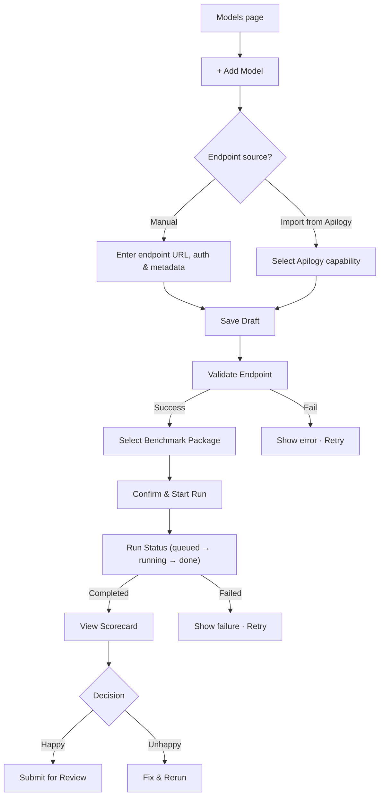
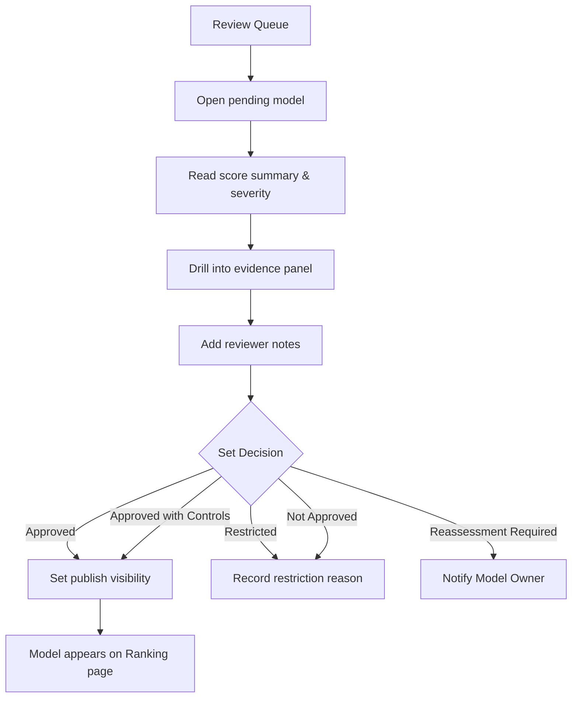
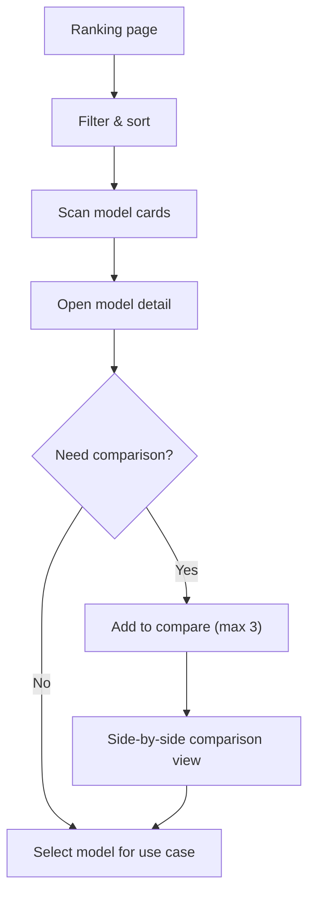
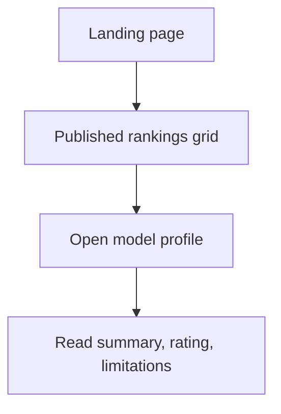

# AI Sandbox – Product UI Specification

> Derived from `02_Product_UI` task files and `01_Planning` source documents.
> Stack: React / Next.js · TypeScript · FastAPI · LiteLLM · Moonshot (MVP benchmark)

---

## 1. User Flows

### 1.1 Model Owner – Submit & Assess



**Entry points:** My Models list, Add Model button, draft model deep-link
**Exit points:** model submitted for review, or parked for rerun

---

### 1.2 Admin / Reviewer – Review & Publish



**Entry points:** Admin Dashboard, Review Queue badge, All Models filter
**Exit points:** decision recorded, publication toggled

---

### 1.3 Use Case Builder / Product Owner – Discover & Choose



**Entry points:** Ranking page, Model Catalog, _(later)_ AgentLab model picker
**Exit points:** model selected, or comparison exported

---

### 1.4 Public Viewer – Read & Trust



**Entry points:** Landing page, shared ranking URL
**Exit points:** awareness gained (read-only)

---

## 2. Page Sections

### 2.1 Page Map (MVP)

| # | Page | Route | Audience | Visibility |
|---|------|-------|----------|------------|
| 1 | Dashboard | `/dashboard` | Admin / Reviewer | Internal |
| 2 | My Models | `/models` | Model Owner | Internal |
| 3 | Add Model | `/models/new` | Model Owner | Internal |
| 4 | Model Detail | `/models/[id]` | Model Owner, Admin | Internal |
| 5 | Benchmark Run | `/models/[id]/runs/[runId]` | Model Owner, Admin | Internal |
| 6 | Review Queue | `/reviews` | Admin / Reviewer | Internal |
| 7 | Review Detail | `/reviews/[id]` | Admin / Reviewer | Internal |
| 8 | Ranking | `/ranking` | Builder, Public | Semi-public |
| 9 | Model Comparison | `/ranking/compare` | Builder | Internal |
| 10 | Public Model Profile | `/models/[id]/public` | Public Viewer | Public |
| 11 | Landing / Home | `/` | Public Viewer | Public |

---

### 2.2 Section Breakdown per Page

#### Dashboard (`/dashboard`)
| Section | Content |
|---------|---------|
| Summary tiles | Total models, Pending reviews, Active runs, Published count |
| Review queue preview | Top 5 pending items with severity indicator |
| Recent runs | Last 10 runs with status badges |
| System health | Job queue length, last failure timestamp |

#### My Models (`/models`)
| Section | Content |
|---------|---------|
| Filter bar | Status, date range, search |
| Model table | Name, provider, status badge, latest score, last run date, actions |
| Empty state | Illustration + CTA to add first model |

#### Add Model (`/models/new`)
| Section | Content |
|---------|---------|
| Source selector | Tab: Manual / Import from Apilogy |
| Form – Manual | Model name, provider, base model, endpoint URL, auth method, API key, model version, intended use case, description |
| Form – Apilogy | Capability search + auto-fill fields |
| Validation panel | Inline field validation, endpoint test button + result |
| Action bar | Save Draft, Validate & Continue |

#### Model Detail (`/models/[id]`)
| Section | Content |
|---------|---------|
| Header | Model name, provider, status badge, created date |
| Stepper | Draft → Validated → Assessed → Reviewed → Published |
| Endpoint card | URL (masked), auth type, validation status, re-validate button |
| Benchmark selector | Available packages with short description |
| Run history table | Run ID, date, status, overall score, actions |
| Scorecard summary | Score blocks (Trust, Security, Privacy, App Readiness, Compliance) |
| Findings accordion | Per-category: severity, count, top items |

#### Benchmark Run (`/models/[id]/runs/[runId]`)
| Section | Content |
|---------|---------|
| Run header | Run ID, package name, status badge, duration |
| Progress tracker | Step-level progress (if available) |
| Scorecard | Same score blocks as Model Detail |
| Evidence panel | Per-finding: prompt, response, verdict, raw artifact link |
| Action bar | _(Model Owner)_ Submit for Review / Rerun · _(Admin)_ Go to Review |

#### Review Queue (`/reviews`)
| Section | Content |
|---------|---------|
| Filter bar | Severity, date, status |
| Queue table | Model name, run date, overall score, critical count, status, CTA |
| Priority indicator | Color-coded row for high-risk items |

#### Review Detail (`/reviews/[id]`)
| Section | Content |
|---------|---------|
| Score summary | Same score blocks |
| Category findings | Grouped list with severity icons |
| Evidence panel | Expandable per finding |
| Reviewer notes | Rich text input |
| Decision drawer | Decision radio group + mandatory reason + Confirm button |
| Publication toggle | Publish / Hide with confirmation dialog |
| Audit trail | Timestamped decision history |

#### Ranking (`/ranking`)
| Section | Content |
|---------|---------|
| Filter bar | Provider, model type, status, use case, score range |
| Ranked grid/table | Rank #, model name, provider, overall score, approval label, suitability tag, compare checkbox |
| Compare bar (sticky) | Selected items count + "Compare" CTA (appears when ≥ 2 selected) |

#### Model Comparison (`/ranking/compare`)
| Section | Content |
|---------|---------|
| Comparison header | Model names side-by-side |
| Score comparison | Radar chart or bar chart per category |
| Attributes table | Strengths, Weaknesses, Restrictions, Recommended use cases |
| Action bar | Select model, Back to ranking |

#### Public Model Profile (`/models/[id]/public`)
| Section | Content |
|---------|---------|
| Hero card | Model name, provider logo, overall rating badge |
| Summary | What it is, what it's good for, main limitations |
| Score overview | Simplified category scores (no raw evidence) |
| Approval label | "Approved", "Approved with Controls", etc. |
| Footer | "Assessment powered by AI Sandbox" |

#### Landing / Home (`/`)
| Section | Content |
|---------|---------|
| Hero | Tagline + CTA to browse rankings |
| Top models | Top 5 published models with rating badges |
| How it works | 3-step visual (Submit → Assess → Publish) |
| Trust statement | Brief text about methodology |

---

## 3. Component List

### 3.1 Reusable from Design System

| Component | Usage |
|-----------|-------|
| `Button` | Primary / Secondary / Ghost actions |
| `Input` / `TextArea` | Form fields |
| `Select` / `Combobox` | Dropdowns, Apilogy capability picker |
| `Table` | Models list, runs list, review queue, ranking |
| `Tabs` | Source selector, scorecard categories |
| `Modal` / `Dialog` | Confirmation dialogs, publish toggle |
| `Toast` / `Notification` | Success / error feedback |
| `Badge` | Status labels, severity tags |
| `Card` | Dashboard tiles, model cards |
| `Tooltip` | Field help text, score explanation |
| `Breadcrumb` | Page hierarchy navigation |
| `Pagination` | Lists with many items |
| `Skeleton` | Loading placeholders |

### 3.2 Sandbox-Specific (Custom Build)

| Component | Description |
|-----------|-------------|
| `StatusBadge` | Extends Badge with workflow-specific color map (see §4) |
| `WorkflowStepper` | Horizontal stepper: Draft → Validated → Assessed → Reviewed → Published |
| `ScoreBlock` | Single category score tile with icon, label, value, and color ring |
| `ScoreCardGrid` | Grid of 5 `ScoreBlock` items for scorecard summary |
| `SeverityIndicator` | Inline severity dot/icon: Critical / High / Medium / Low / Info |
| `FindingsAccordion` | Collapsible group: category header, count, severity summary → per-finding rows |
| `EvidencePanel` | Slide-out or inline panel: prompt text, model response, verdict, raw link |
| `DecisionDrawer` | Side drawer: decision radio group, mandatory reason field, confirm CTA |
| `CompareBar` | Sticky bottom bar: selected model chips + Compare CTA |
| `CompareTable` | Side-by-side attribute table for 2–3 models |
| `RadarChart` | Category comparison chart (e.g., recharts or chart.js) |
| `RunProgressTracker` | Live-updating step tracker for benchmark execution |
| `EndpointValidationCard` | URL preview, test button, result badge, retry action |
| `PublicationToggle` | Switch with confirmation: Publish / Hide |
| `AuditTrailTimeline` | Vertical timeline of reviewer decisions and status changes |
| `RankBadge` | Numeric rank circle shown on ranking and public pages |
| `EmptyStateBlock` | Illustration + title + description + CTA (reusable shell) |

---

## 4. Empty / Loading / Error States

### 4.1 Status Badge Color Map

| Status | Color | Hex suggestion |
|--------|-------|----------------|
| Draft | `gray` | `#6B7280` |
| Endpoint Validation Pending | `amber` | `#F59E0B` |
| Endpoint Valid | `teal` | `#14B8A6` |
| Validation Failed | `red` | `#EF4444` |
| Run Queued | `blue` | `#3B82F6` |
| Run In Progress | `blue` (animated pulse) | `#3B82F6` |
| Run Failed | `red` | `#EF4444` |
| Pending Review | `amber` | `#F59E0B` |
| Approved | `green` | `#22C55E` |
| Approved with Controls | `lime` | `#84CC16` |
| Restricted | `orange` | `#F97316` |
| Reassessment Required | `amber` | `#F59E0B` |
| Not Approved | `red` | `#EF4444` |
| Published | `green` (with globe icon) | `#22C55E` |
| Hidden | `gray` (with eye-off icon) | `#6B7280` |

### 4.2 State Definitions per Page

#### My Models – Empty
| Attribute | Value |
|-----------|-------|
| Illustration | Empty box or robot illustration |
| Title | "Belum ada model" / "No models yet" |
| Description | "Mulai dengan mendaftarkan model AI pertama Anda." / "Start by registering your first AI model." |
| CTA | `+ Tambah Model` / `+ Add Model` |

#### My Models – Loading
| Attribute | Value |
|-----------|-------|
| Pattern | Skeleton rows (5 rows) matching table columns |
| Duration | Show skeleton ≤ 3 s → auto-error if timeout |

#### My Models – Error
| Attribute | Value |
|-----------|-------|
| Title | "Gagal memuat daftar model" / "Failed to load models" |
| Description | "Terjadi kesalahan saat mengambil data. Coba lagi." / "Something went wrong. Please try again." |
| CTA | `Coba Lagi` / `Retry` |

---

#### Endpoint Validation – Loading
| Attribute | Value |
|-----------|-------|
| Pattern | Spinner inside the `EndpointValidationCard` |
| Label | "Memvalidasi endpoint..." / "Validating endpoint…" |

#### Endpoint Validation – Success
| Attribute | Value |
|-----------|-------|
| Icon | ✓ checkmark, teal |
| Label | "Endpoint tervalidasi" / "Endpoint validated" |

#### Endpoint Validation – Failure
| Attribute | Value |
|-----------|-------|
| Icon | ✕ cross, red |
| Title | "Validasi gagal" / "Validation failed" |
| Detail | Show error code + short technical reason behind toggle "Lihat Detail" / "View Details" |
| CTA | `Coba Lagi` / `Retry` |

---

#### Benchmark Run – Queued
| Attribute | Value |
|-----------|-------|
| Icon | Clock |
| Label | "Dalam antrean" / "Queued" |
| Subtext | "Posisi antrean: #N" / "Queue position: #N" (if available) |

#### Benchmark Run – Running
| Attribute | Value |
|-----------|-------|
| Pattern | Animated progress bar or step tracker |
| Label | "Benchmark sedang berjalan…" / "Benchmark running…" |
| Subtext | Elapsed time + estimated remaining (if available) |

#### Benchmark Run – Failed
| Attribute | Value |
|-----------|-------|
| Icon | ⚠ warning, red |
| Title | "Benchmark gagal" / "Benchmark failed" |
| Detail | Error summary + expandable technical log |
| CTA | `Jalankan Ulang` / `Rerun` |

#### Benchmark Run – Completed
| Attribute | Value |
|-----------|-------|
| Icon | ✓ checkmark, green |
| Label | "Selesai" / "Completed" |
| CTA | `Lihat Scorecard` / `View Scorecard` |

---

#### Review Queue – Empty
| Attribute | Value |
|-----------|-------|
| Illustration | Clipboard with checkmark |
| Title | "Tidak ada review yang tertunda" / "No pending reviews" |
| Description | "Semua model telah ditinjau." / "All models have been reviewed." |

#### Review Queue – Loading
| Attribute | Value |
|-----------|-------|
| Pattern | Skeleton rows (5 rows) |

---

#### Ranking – Empty
| Attribute | Value |
|-----------|-------|
| Illustration | Trophy or podium |
| Title | "Belum ada model yang dipublikasikan" / "No published models yet" |
| Description | "Model yang disetujui akan muncul di sini." / "Approved models will appear here." |

#### Ranking – Loading
| Attribute | Value |
|-----------|-------|
| Pattern | Skeleton cards / rows (6 items) |

#### Ranking – Error
| Attribute | Value |
|-----------|-------|
| Title | "Gagal memuat peringkat" / "Failed to load rankings" |
| CTA | `Coba Lagi` / `Retry` |

---

#### Evidence Panel – Unavailable
| Attribute | Value |
|-----------|-------|
| Title | "Bukti tidak tersedia" / "Evidence not available" |
| Description | "Data bukti untuk temuan ini sedang diproses atau telah kedaluwarsa." / "Evidence data for this finding is being processed or has expired." |

---

#### Access Denied (any page)
| Attribute | Value |
|-----------|-------|
| Illustration | Lock icon |
| Title | "Akses ditolak" / "Access denied" |
| Description | "Anda tidak memiliki izin untuk melihat halaman ini." / "You do not have permission to view this page." |
| CTA | `Kembali` / `Go Back` |

---

#### Model Restricted Banner (inline)
| Attribute | Value |
|-----------|-------|
| Pattern | Warning banner at top of Model Detail |
| Label | "Model ini dibatasi" / "This model is restricted" |
| Subtext | "Hubungi admin untuk informasi lebih lanjut." / "Contact admin for more details." |

---

## 5. UX Copy Suggestions

### 5.1 Navigation Labels

| Key | ID | EN |
|-----|----|----|
| nav.mymodels | Model Saya | My Models |
| nav.addmodel | + Tambah Model | + Add Model |
| nav.runs | Eksekusi | Runs |
| nav.results | Hasil | Results |
| nav.dashboard | Dasbor | Dashboard |
| nav.reviewqueue | Antrean Review | Review Queue |
| nav.allmodels | Semua Model | All Models |
| nav.publication | Publikasi | Publication |
| nav.system | Sistem | System |
| nav.ranking | Peringkat | Ranking |
| nav.compare | Bandingkan | Compare |
| nav.home | Beranda | Home |
| nav.profiles | Profil Model | Model Profiles |

### 5.2 Action Labels

| Key | ID | EN |
|-----|----|----|
| action.savedraft | Simpan Draf | Save Draft |
| action.validate | Validasi Endpoint | Validate Endpoint |
| action.startrun | Mulai Benchmark | Start Benchmark |
| action.rerun | Jalankan Ulang | Rerun |
| action.submitreview | Ajukan untuk Review | Submit for Review |
| action.approve | Setujui | Approve |
| action.approvewithcontrols | Setujui dengan Kontrol | Approve with Controls |
| action.restrict | Batasi | Restrict |
| action.reassess | Minta Evaluasi Ulang | Request Reassessment |
| action.notapprove | Tolak | Not Approved |
| action.publish | Publikasikan | Publish |
| action.hide | Sembunyikan | Hide |
| action.compare | Bandingkan Model | Compare Models |
| action.selectmodel | Pilih Model | Select Model |
| action.retry | Coba Lagi | Retry |
| action.viewscorecard | Lihat Scorecard | View Scorecard |
| action.viewdetails | Lihat Detail | View Details |

### 5.3 Score Block Labels

| Key | ID | EN |
|-----|----|----|
| score.trust | Kepercayaan Model | Model Trust |
| score.security | Keamanan | Security |
| score.privacy | Privasi | Privacy |
| score.readiness | Kesiapan Aplikasi | Application Readiness |
| score.compliance | Cakupan Kepatuhan | Compliance Coverage |

### 5.4 Confirmation Dialogs

| Scenario | Title (ID) | Body (ID) |
|----------|------------|-----------|
| Submit for Review | "Ajukan Model untuk Review?" | "Setelah diajukan, Anda tidak dapat mengubah hasil benchmark ini. Lanjutkan?" |
| Approve Model | "Setujui Model Ini?" | "Model akan tersedia untuk dipublikasikan. Pastikan semua temuan telah ditinjau." |
| Restrict Model | "Batasi Model Ini?" | "Model tidak akan muncul di halaman peringkat. Alasan wajib diisi." |
| Publish Model | "Publikasikan ke Peringkat?" | "Model akan terlihat oleh semua pengguna di halaman peringkat publik." |
| Rerun Benchmark | "Jalankan Ulang Benchmark?" | "Hasil sebelumnya akan tetap tersimpan sebagai riwayat." |

### 5.5 Microcopy

| Location | ID | EN |
|----------|----|-----|
| Add Model source hint | "Pilih sumber endpoint: masukkan manual atau impor dari Apilogy" | "Choose endpoint source: enter manually or import from Apilogy" |
| Benchmark package description | "Paket Kepercayaan Inti Indonesia — menguji keamanan, privasi, bias, dan kepatuhan untuk konteks Indonesia" | "Indonesia Core Trust Package — tests security, privacy, bias, and compliance for the Indonesian context" |
| Scorecard quick insight | "Skor ini mencerminkan hasil benchmark otomatis, bukan keputusan akhir." | "This score reflects automated benchmark results, not a final decision." |
| Review decision disclaimer | "Keputusan Anda akan dicatat dan dapat diaudit." | "Your decision will be recorded and is auditable." |
| Public profile footer | "Penilaian dilakukan oleh AI Sandbox · Hasil terakhir diperbarui {date}" | "Assessment by AI Sandbox · Last updated {date}" |

---

## 6. Implementation Notes for Developer

### 6.1 Architecture Guidance

- **Routing:** Use Next.js App Router with route groups:
  - `(internal)/dashboard`, `(internal)/models/[id]`, `(internal)/reviews/[id]`
  - `(public)/ranking`, `(public)/models/[id]/public`, `(public)/`
- **Auth middleware:** Check role on every route via Next.js middleware.  
  Redirect unauthorized users to Access Denied page. Use server-side session (cookie/JWT) from FastAPI.
- **API layer:** All data fetched via FastAPI REST endpoints.  
  Use SWR or TanStack Query for client-side caching, optimistic updates, and retry.
- **i18n:** Use `next-intl` or `react-intl`.  
  All user-facing strings must come from locale JSON keyed by the keys in §5.  
  Default locale: `id`. Fallback locale: `en`.

### 6.2 State Management

- **Workflow status** is the single source of truth from the backend (`model.status`).
- Frontend should **never compute status locally** — always read from API.
- Use a shared `statusConfig` map to drive badge color, icon, and label from one place:
  ```ts
  // lib/statusConfig.ts
  export const statusConfig: Record<ModelStatus, {
    color: string;
    icon: string;
    labelKey: string;
  }> = {
    draft:                { color: '#6B7280', icon: 'file',        labelKey: 'status.draft' },
    endpoint_valid:       { color: '#14B8A6', icon: 'check',       labelKey: 'status.endpointValid' },
    validation_failed:    { color: '#EF4444', icon: 'x-circle',    labelKey: 'status.validationFailed' },
    run_queued:           { color: '#3B82F6', icon: 'clock',       labelKey: 'status.runQueued' },
    run_in_progress:      { color: '#3B82F6', icon: 'loader',      labelKey: 'status.runInProgress' },
    run_failed:           { color: '#EF4444', icon: 'alert',       labelKey: 'status.runFailed' },
    pending_review:       { color: '#F59E0B', icon: 'eye',         labelKey: 'status.pendingReview' },
    approved:             { color: '#22C55E', icon: 'check-circle', labelKey: 'status.approved' },
    approved_with_controls: { color: '#84CC16', icon: 'shield',    labelKey: 'status.approvedWithControls' },
    restricted:           { color: '#F97316', icon: 'ban',         labelKey: 'status.restricted' },
    reassessment_required: { color: '#F59E0B', icon: 'refresh',   labelKey: 'status.reassessmentRequired' },
    not_approved:         { color: '#EF4444', icon: 'x-circle',    labelKey: 'status.notApproved' },
    published:            { color: '#22C55E', icon: 'globe',       labelKey: 'status.published' },
    hidden:               { color: '#6B7280', icon: 'eye-off',     labelKey: 'status.hidden' },
  };
  ```

### 6.3 Permission Matrix (implement via middleware + component-level guard)

| Page / Action | Model Owner | Admin / Reviewer | Builder | Public |
|---------------|:-----------:|:----------------:|:-------:|:------:|
| Dashboard | — | ✓ | — | — |
| My Models (own) | ✓ | ✓ (all) | — | — |
| Add Model | ✓ | ✓ | — | — |
| Model Detail (own) | ✓ R | ✓ RW | — | — |
| Model Detail (other) | — | ✓ R | — | — |
| Start Benchmark | ✓ | ✓ | — | — |
| Submit for Review | ✓ | — | — | — |
| Review Queue | — | ✓ | — | — |
| Set Decision | — | ✓ | — | — |
| Publish / Hide | — | ✓ | — | — |
| Ranking | — | ✓ | ✓ | ✓ |
| Model Comparison | — | ✓ | ✓ | — |
| Public Profile | — | — | ✓ | ✓ |
| Evidence Panel | ✓ (own) | ✓ | — | — |

- `R` = read, `RW` = read + write, `✓` = full access for that page, `—` = no access

### 6.4 Key API Endpoints Expected from Backend

| Method | Endpoint | Notes |
|--------|----------|-------|
| `GET` | `/api/models` | Filter: `?status=`, `?owner=`, `?search=` |
| `POST` | `/api/models` | Create draft. Body: model metadata |
| `GET` | `/api/models/:id` | Full model detail |
| `PATCH` | `/api/models/:id` | Update metadata |
| `POST` | `/api/models/:id/validate` | Trigger endpoint validation |
| `POST` | `/api/models/:id/runs` | Start benchmark run |
| `GET` | `/api/models/:id/runs` | List runs for model |
| `GET` | `/api/models/:id/runs/:runId` | Run detail + scorecard |
| `GET` | `/api/models/:id/runs/:runId/evidence` | Evidence for findings |
| `POST` | `/api/models/:id/submit-review` | Submit for review |
| `GET` | `/api/reviews` | Review queue list |
| `GET` | `/api/reviews/:id` | Review detail |
| `POST` | `/api/reviews/:id/decision` | Set decision + notes |
| `POST` | `/api/models/:id/publication` | Publish / Hide toggle |
| `GET` | `/api/ranking` | Published ranked models. Filter: provider, type, score range |
| `GET` | `/api/ranking/compare?ids=a,b,c` | Comparison data |
| `GET` | `/api/models/:id/public` | Public profile (sanitized) |
| `GET` | `/api/health` | System health (admin only) |

### 6.5 Design System Integration

- Import the base component library from the Chromatic Storybook: `https://6420e4161e2acdd49d1d3e4b-hfuodunylt.chromatic.com`
- **Reuse directly:** Button, Input, Select, Table, Tabs, Modal, Tooltip, Badge, Card, Breadcrumb, Pagination, Skeleton
- **Extend:** Badge → `StatusBadge` with `statusConfig` driven color + icon
- **Custom build:**
  - `WorkflowStepper` — wrap the stepper pattern from the design system with sandbox-specific steps
  - `ScoreBlock` + `ScoreCardGrid` — new components, use design system Card as shell
  - `FindingsAccordion` — use Accordion base if available, otherwise build custom
  - `EvidencePanel` — slide panel or drawer, new component
  - `DecisionDrawer` — Drawer base + form
  - `CompareBar` + `CompareTable` — entirely new
  - `RadarChart` — use `recharts` library
  - `RunProgressTracker` — new component with polling / WebSocket for live updates

### 6.6 Polling & Real-Time Strategy

| Feature | Strategy |
|---------|----------|
| Endpoint validation | Short-poll `/api/models/:id` every 3 s while status is `validation_pending`. Stop on `endpoint_valid` or `validation_failed`. |
| Benchmark run | Poll `/api/models/:id/runs/:runId` every 5 s while `run_in_progress`. Use WebSocket if available for MVP+. |
| Review queue badge | Poll `/api/reviews?status=pending&count_only=true` every 30 s for the sidebar badge number. |

### 6.7 Accessibility & Performance

- All interactive elements must have unique `id` attributes for browser testing.
- Maintain WCAG 2.1 AA contrast on all status badge colors against their backgrounds.
- Use `aria-live="polite"` for run status updates so screen readers announce changes.
- Lazy-load the evidence panel and chart components to keep the initial page bundle small.
- Skeleton loaders must match the final layout dimensions to prevent layout shift (CLS ≈ 0).

### 6.8 Localization Checklist

- [ ] All strings in locale JSON files (`id.json`, `en.json`)
- [ ] Date / time formatted per locale (`id`: `dd/MM/yyyy HH:mm`, `en`: `MMM d, yyyy h:mm a`)
- [ ] Number formatting for scores (use `Intl.NumberFormat`)
- [ ] Indonesia-specific risk labels (e.g., "SARA", "UU PDP", "Konten Radikal") added to locale files
- [ ] RTL not required but layout should not hardcode LTR-specific padding

### 6.9 Testing & QA Priorities

| Priority | Test |
|----------|------|
| P0 | Add Model form → validation → draft created |
| P0 | Endpoint validation → success / failure states render correctly |
| P0 | Benchmark run → status transitions render correctly |
| P0 | Review decision → status update + audit trail |
| P0 | Permission guard → unauthorized role cannot access restricted pages |
| P1 | Ranking filters produce correct results |
| P1 | Model comparison view renders 2–3 models correctly |
| P1 | Empty / loading / error states render for every page |
| P2 | Locale switch renders all strings correctly in both languages |
| P2 | Mobile responsiveness for ranking and public profile pages |
