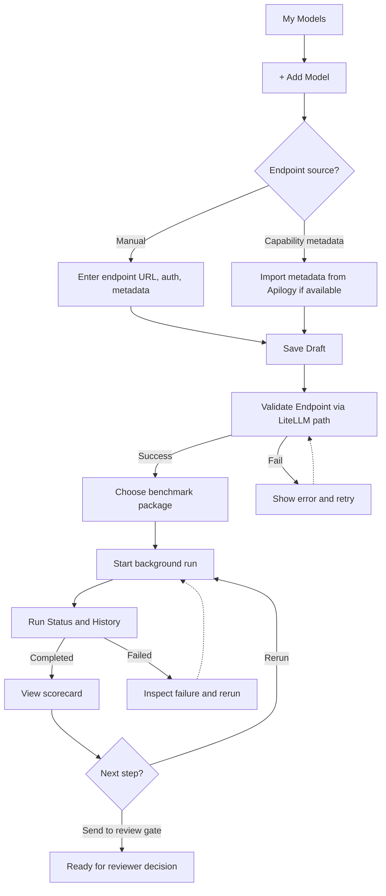
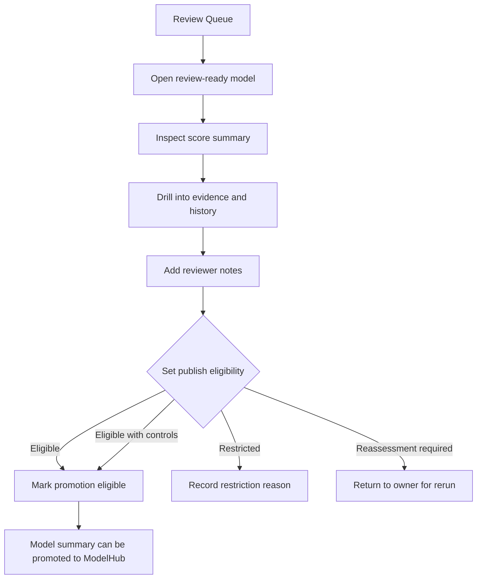
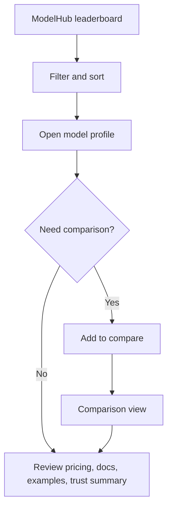
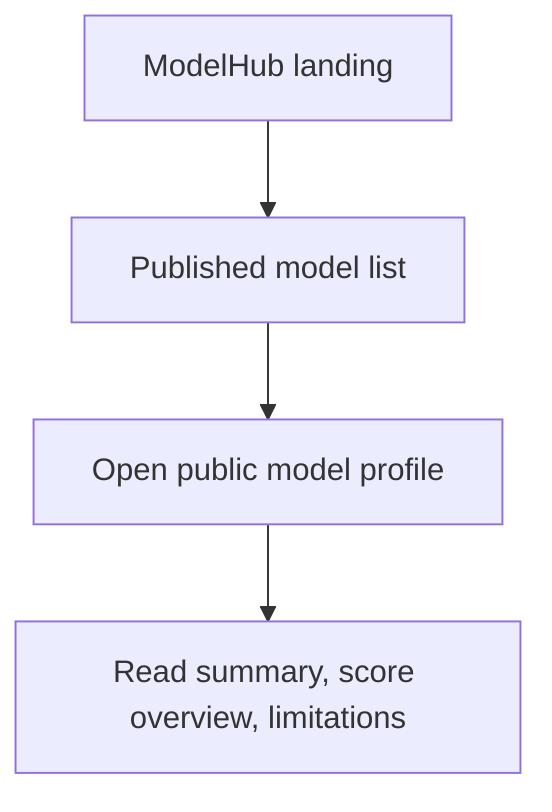
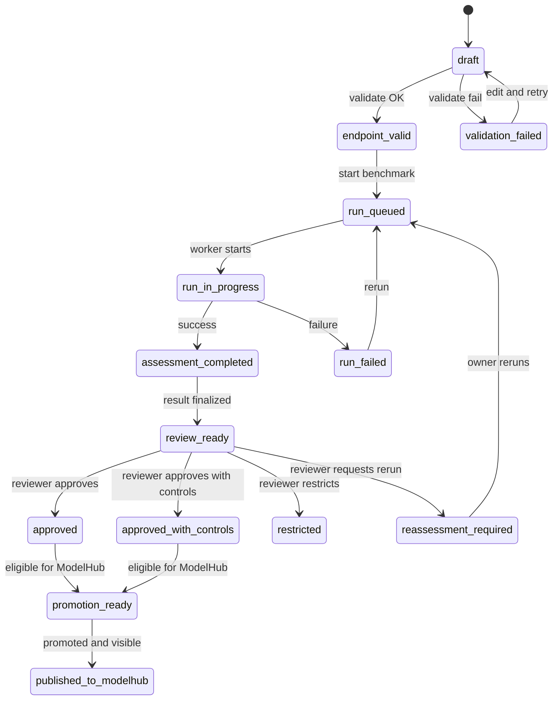

# AI Sandbox and ModelHub - User Flows

> Source: `01_Planning/Product_Alignment_Update_2026-03-11.md`
> Scope: current MVP direction with `AI Sandbox` as the internal testing surface and `ModelHub` as the discovery surface

---

## Product Goal

Enable a connected trust flow:
**Register -> Validate -> Assess -> Review Gate -> Promote -> Discover**

Important product split:

- `AI Sandbox` is used by `Model Owner` or `Model Vendor` and `Admin / Reviewer`
- `ModelHub` is used by `Developer` and `Use Case Owner`

---

## 1. AI Sandbox - Model Owner / Vendor Flow

| Attribute | Detail |
|-----------|--------|
| Surface | `AI Sandbox` |
| Entry points | My Models, Add Model, draft deep-link |
| Exit points | Review-ready result or rerun |
| Key states | `draft` -> `endpoint_valid` / `validation_failed` -> `run_queued` -> `run_in_progress` -> `run_failed` / `assessment_completed` -> `review_ready` |

### Decision Points and Edge Cases

| Decision Point | Happy Path | Edge Case |
|----------------|------------|-----------|
| Endpoint source | Manual entry with required config | `Apilogy` metadata is incomplete; owner must confirm fields manually |
| Validation | Pass through `LiteLLM` path | Failure requires actionable error, not only raw logs |
| Benchmark run | Background run completes | User navigates away; run must continue and history must persist |
| Scorecard review | Owner understands result and next action | Multiple reruns require version history and comparison |

---

## 2. AI Sandbox - Admin / Reviewer Flow

| Attribute | Detail |
|-----------|--------|
| Surface | `AI Sandbox` |
| Entry points | Dashboard, Review Queue, Completed Assessments |
| Exit points | Promotion-eligible result or restriction |
| Key states | `review_ready` -> `approved` / `approved_with_controls` / `restricted` / `reassessment_required` |

### Decision Points and Edge Cases

| Decision Point | Happy Path | Edge Case |
|----------------|------------|-----------|
| Evidence inspection | Reviewer finds clear evidence | Ambiguous cases require drill-down into prompt and response evidence |
| Decision | Approved or approved with controls | Restricted and reassessment paths require mandatory reason |
| Promotion gate | Eligible result sent to `ModelHub` | Score D or E must not be promoted |

---

## 3. ModelHub - Developer / Use Case Owner Flow

| Attribute | Detail |
|-----------|--------|
| Surface | `ModelHub` |
| Entry points | Leaderboard, model catalog, shared model link |
| Exit points | Model shortlisted for use case or compared |
| Key states | Only promoted and publishable models are visible |

### Decision Points and Edge Cases

| Decision Point | Happy Path | Edge Case |
|----------------|------------|-----------|
| Filter | Narrow by provider, score, pricing, use case | No results should show a guided empty state |
| Comparison | Select 2 to 3 models | Attempt to compare too many models should be blocked clearly |
| Profile review | Builder sees trust summary and restrictions | Internal evidence and reviewer notes must never appear here |

---

## 4. Public or Wider Internal Viewer Flow

| Attribute | Detail |
|-----------|--------|
| Surface | `ModelHub` |
| Entry points | Landing page, shared ranking URL |
| Exit points | Read-only awareness |
| Key states | Only published and safe-to-share summaries are visible |

### Edge Cases

- no promoted models yet should show a proper empty state
- withdrawn or unpublished profiles should not expose stale data
- restricted evidence must never leak into public profile views

---

## 5. Cross-Surface State Machine

### Persona Visibility by State

| State Range | Model Owner | Admin / Reviewer | Developer / Use Case Owner | Public |
|-------------|:-----------:|:----------------:|:---------------------------:|:------:|
| `draft` -> `assessment_completed` | Yes | Yes | No | No |
| `review_ready` -> decision | Read-only | Full | No | No |
| `approved` / `approved_with_controls` | Read-only | Full | No | No |
| `published_to_modelhub` | Read-only | Full | Yes | Conditional |
| `restricted` / `reassessment_required` | Read-only | Full | No | No |

---

## 6. Navigation Map by Surface

| Surface | Persona | Main Areas | Default Landing |
|---------|---------|------------|-----------------|
| `AI Sandbox` | Model Owner | My Models, Add Model, Runs, Results | `/models` |
| `AI Sandbox` | Admin / Reviewer | Dashboard, Review Queue, All Models, Runs, Publication Gate | `/dashboard` |
| `ModelHub` | Developer / Use Case Owner | Leaderboard, Model Profile, Compare | `/ranking` |
| `ModelHub` | Public Viewer | Home, Published Models, Model Profiles | `/` |

---

## Assumptions

1. MVP keeps one main benchmark foundation and a narrow review gate.
2. `LiteLLM` is the primary endpoint access abstraction.
3. Benchmark execution runs in the background.
4. Benchmark history and version comparison are required.
5. Promotion to `ModelHub` is separate from raw sandbox completion.
6. `ModelHub` may show richer metadata than the sandbox scorecard, including pricing, documentation, and use case examples.
