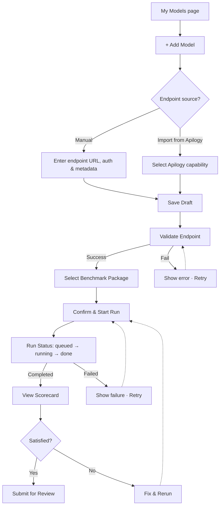
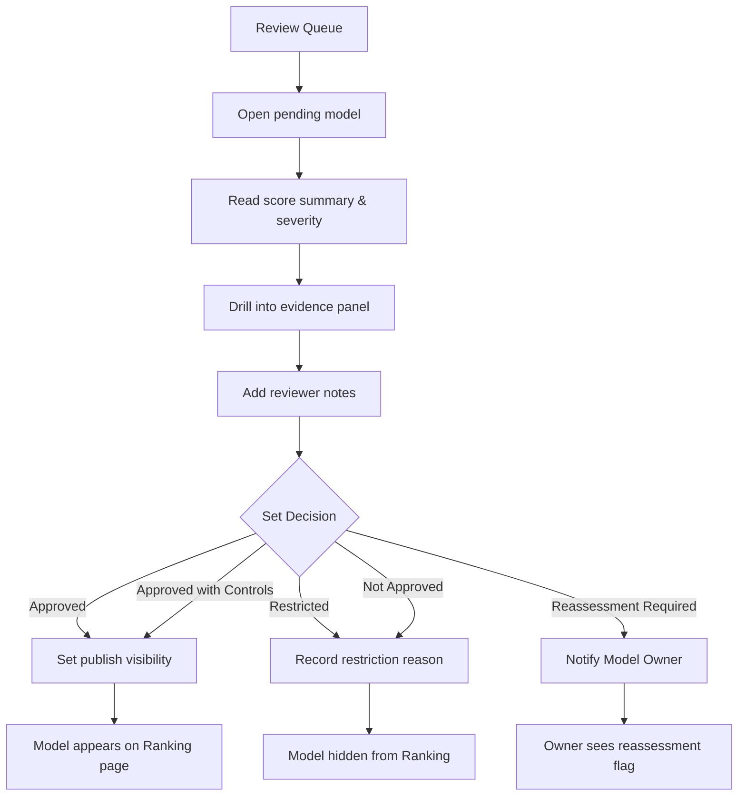
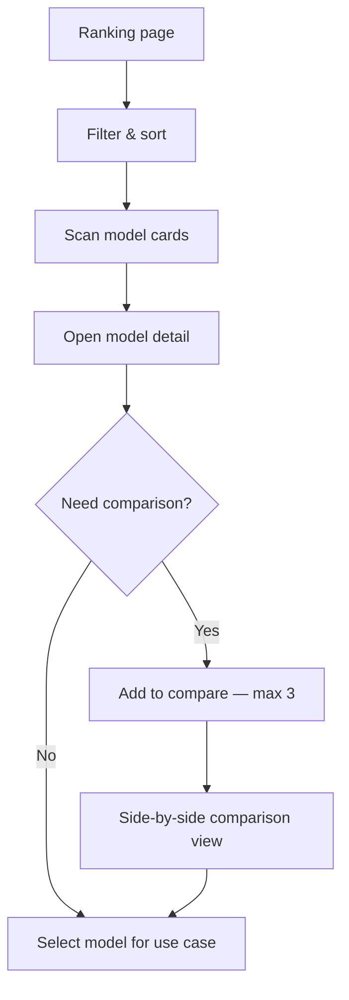
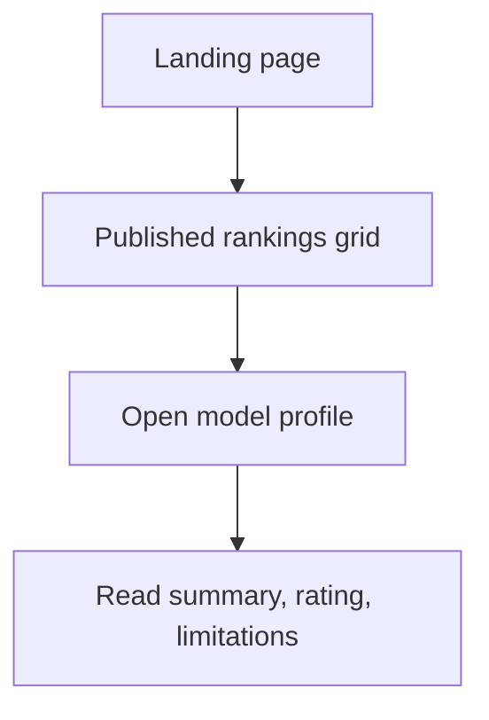
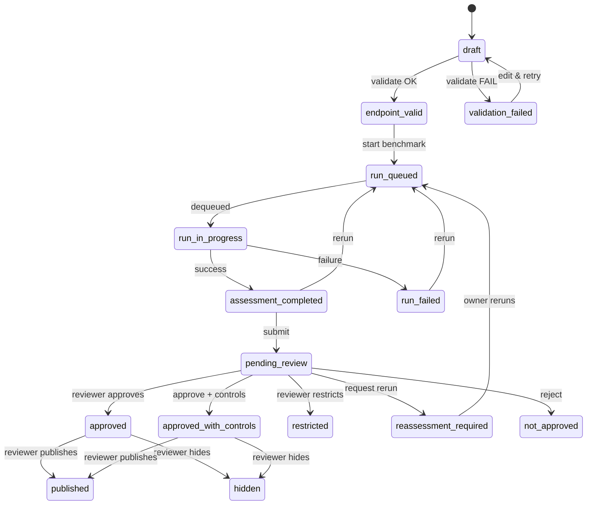

# AI Sandbox – User Flows

> Source: `Product_UI_Specification.md` §1, §2.1
> Scope: MVP only — 4 personas, 11 pages, 1 benchmark package

---

## Product Goal

Enable a trust-driven model selection loop:
**Submit → Assess → Review → Publish → Discover**

---

## 1. Model Owner — Submit & Assess

| Attribute | Detail |
|-----------|--------|
| Entry points | My Models list · `+ Add Model` button · draft deep-link |
| Exit points | Model submitted for review · model parked for rerun |
| Key states | `draft` → `endpoint_valid` / `validation_failed` → `run_queued` → `run_in_progress` → `run_failed` / `assessment_completed` → `pending_review` |

### Decision Points & Edge Cases

| Decision Point | Happy Path | Edge Case |
|----------------|------------|-----------|
| Endpoint source? | Manual entry | Apilogy import may auto-fill fields; user must verify before saving |
| Endpoint validation | Pass on first try | Fail → show error code behind "View Details" toggle → Retry |
| Benchmark run | Complete in < 5 min | Timeout / partial failure → user sees failure state with expandable log → Rerun |
| Scorecard review | Submit for Review | Owner reruns multiple times; run history must show all past runs |

---

## 2. Admin / Reviewer — Review & Publish

| Attribute | Detail |
|-----------|--------|
| Entry points | Dashboard · Review Queue badge · All Models (filter: `pending_review`) |
| Exit points | Decision recorded + publication toggled |
| Key states | `pending_review` → `approved` / `approved_with_controls` / `restricted` / `reassessment_required` / `not_approved` → `published` / `hidden` |

### Decision Points & Edge Cases

| Decision Point | Happy Path | Edge Case |
|----------------|------------|-----------|
| Inspect findings | Clear-cut severity | Ambiguous finding → reviewer drills into evidence panel for prompt/response detail |
| Set decision | Approve outright | "Approved with Controls" → mandatory reason field; "Restrict" → mandatory reason |
| Publication | Publish immediately | Reviewer decides to delay → model stays `hidden` even after approval |
| Multiple reviewers | Single reviewer per model (MVP) | If a decision already exists, show audit trail and allow override with reason |

---

## 3. Use Case Builder / Product Owner — Discover & Choose

| Attribute | Detail |
|-----------|--------|
| Entry points | Ranking page · Model Catalog · _(later)_ AgentLab model picker |
| Exit points | Model selected for use case · comparison reviewed |
| Key states | Only sees `approved`, `approved_with_controls`, `published` models |

### Decision Points & Edge Cases

| Decision Point | Happy Path | Edge Case |
|----------------|------------|-----------|
| Filter | Narrow by provider / score | Zero results → show "No models match" empty state with clear-filter CTA |
| Compare | Select 2 models | Try to add 4th → show toast "Maximum 3 models for comparison" |
| Model detail | Reads summary + score | Model has "Approved with Controls" → restrictions block shown prominently |

---

## 4. Public Viewer — Read & Trust

| Attribute | Detail |
|-----------|--------|
| Entry points | Landing page · shared ranking URL |
| Exit points | Read-only — awareness gained |
| Key states | Only sees `published` models |

### Edge Cases

- **No published models yet** → show trophy illustration + "Approved models will appear here."
- **Model unpublished after sharing** → return 404 or "This model profile is no longer available."
- **Restricted evidence leak** → Public Profile must never render raw evidence or reviewer notes.

---

## 5. Cross-Journey State Machine

### Persona Visibility by State

| State Range | Model Owner | Admin / Reviewer | Builder | Public |
|-------------|:-----------:|:----------------:|:-------:|:------:|
| `draft` → `assessment_completed` | ✓ | ✓ | — | — |
| `pending_review` → decision | Read-only | ✓ Full | — | — |
| `approved` / `approved_with_controls` | Read-only | ✓ Full | ✓ | — |
| `published` | Read-only | ✓ Full | ✓ | ✓ |
| `restricted` / `not_approved` / `hidden` | Read-only (own) | ✓ Full | — | — |

---

## 6. Navigation Map by Persona

| Persona | Sidebar Items | Default Landing |
|---------|---------------|-----------------|
| Model Owner | My Models · + Add Model · Runs · Results | `/models` |
| Admin / Reviewer | Dashboard · Review Queue · All Models · Runs · Publication · System | `/dashboard` |
| Builder | Ranking · Models · Compare | `/ranking` |
| Public Viewer | Home · Rankings · Model Profiles | `/` |

---

## Assumptions

1. **MVP is single reviewer per model** — no multi-approval chain.
2. **One benchmark package** ("Indonesia Core Trust Package") — no package picker complexity.
3. **Publication is a separate toggle** from the approval decision — they are never combined into one click.
4. **Model comparison is capped at 3** — design does not scale to N-way comparison for MVP.
5. **Builder cannot see restricted or hidden models** — even if they previously viewed them.
6. **Apilogy import auto-fills fields** but the owner must re-confirm before saving draft.
