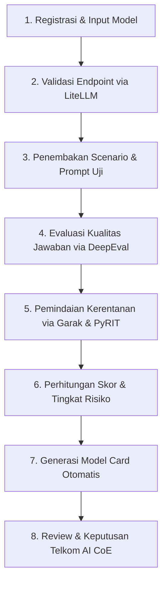

# 2. SOLUSI AI YANG DIUSULKAN

Sebagai respons strategis terhadap tantangan di atas, Telkom AI CoE (Center of Excellence) menginisiasi pengembangan **AI-Powered Sandbox** di dalam payung ekosistem **SecurityAI**. Solusi ini dirancang bukan sekadar sebagai portal dokumentasi atau daftar periksa (*checklist*) manual, melainkan sebagai sebuah **sistem pendukung keputusan berbasis kecerdasan buatan (*AI-assisted decision-support system*)** yang secara otomatis menguji, mengukur, dan memverifikasi kelayakan model AI lain.

## 2.1 Konsep AI-Powered Sandbox
**AI-Powered Sandbox** adalah lingkungan evaluasi terkendali (*controlled evaluation environment*) yang memanfaatkan kapabilitas kecerdasan buatan untuk mengotomatisasi pengujian kualitas kognitif, kepatuhan keamanan (*security alignment*), proteksi privasi, dan kelayakan biaya dari model-model AI sebelum direkomendasikan masuk ke dalam katalog korporat di **ModelHub** maupun diintegrasikan ke lingkungan pembangun agen di **AgentLab**. 

Secara arsitektural, solusi ini menggunakan pendekatan **Unified Python Stack** untuk mengintegrasikan alat pengujian berstandar global secara mulus dan terpusat:
- **LiteLLM**: Sebagai API Gateway pintar untuk standarisasi skema request/response, pencatatan latensi, token usage, dan tracking estimasi biaya riil (dalam IDR) berdasarkan skema tarif eksternal dan interkoneksi **Apilogy**.
- **DeepEval & Ragas**: Kerangka pengujian berbasis Python untuk otomatisasi evaluasi kualitas jawaban menggunakan logika *LLM-as-a-Judge*, mencakup metrik *Faithfulness* (kesetiaan data untuk mencegah halusinasi dalam sistem RAG), *Answer Relevancy*, dan *Context Precision*.
- **Garak & PyRIT**: Mesin pemindai kerentanan otomatis (*offensive vulnerability scanner*) untuk membombardir model kandidat dengan ribuan skenario serangan penetrasi, termasuk upaya manipulasi *prompt*, jailbreak, dan ekstraksi instruksi sistem (*system prompt extraction*).
- **Giskard**: Penguji aspek etika AI untuk mengidentifikasi keberpihakan (*bias*) dan laju toksisitas verbal (*toxicity rate*).
- **LLM Guard**: Modul interseptor privasi real-time yang mensimulasikan kepatuhan pelindungan data dengan mengukur tingkat kebocoran data sensitif (*PII Leakage Volume*) dan memblokir konten berbahaya sebelum keluar dari model.

## 2.2 Alur Kerja Sistem (Workflow)
Proses evaluasi pada AI-Powered Sandbox berjalan melalui 8 langkah sistematis berikut:

1. **Registrasi Model**: Pengembang model mendaftarkan kandidat model AI mereka ke Sandbox (baik secara manual maupun otomatis via katalog *Apilogy*).
2. **Validasi Endpoint**: Sistem memvalidasi ketersediaan dan latensi koneksi model menggunakan adapter *LiteLLM*.
3. **Penembakan Scenario**: AI Sandbox menembakkan ribuan instruksi uji (*test prompts*) dan skenario risiko (*adversarial scenarios*) yang disesuaikan dengan konteks regulasi lokal Indonesia (termasuk filter sensitivitas SARA dan Konten Radikal).
4. **Evaluasi Kualitas**: Sistem menggunakan evaluator AI otomatis (*DeepEval*) untuk menganalisis akurasi, relevansi, dan kepatuhan jawaban model terhadap instruksi dasar.
5. **Pemindaian Keamanan**: Sistem menjalankan simulasi serangan penetrasi (*vulnerability scanning*) secara simultan melalui *Garak* dan *PyRIT*.
6. **Kalkulasi Skor**: Sistem mengalkulasi parameter evaluasi menjadi skor kuantitatif (skala 0–100) dan menentukan tingkat risiko (Excellent, Good, Moderate, Poor, Critical).
7. **Penyusunan Model Card**: Sistem menghasilkan ringkasan kelayakan (*Model Card*) secara otomatis menggunakan teknologi GenAI summarizer, menyajikan rekomendasi kasus penggunaan (*intended use case*) serta batasan model (*restrictions*).
8. **Keputusan Tata Kelola**: Berdasarkan bukti teknis (*technical evidence*) tersebut, *Telkom AI CoE* melakukan review akhir (Approved, Approved with Controls, Restrict, Reassessment, Not Approved) sebelum dipromosikan ke katalog utama di **ModelHub**.

## 2.3 Nilai Tambah Dibandingkan Pendekatan Konvensional

| Aspek Evaluasi | Pendekatan Konvensional | Pendekatan AI-Powered Sandbox |
| :--- | :--- | :--- |
| **Metode Pengujian** | Pengujian manual, berbasis tebakan, dan tidak dapat diulang. | Pengujian terstruktur dengan ribuan skenario otomatis yang *reusable*. |
| **Objektivitas** | Penilaian bersifat subjektif berdasarkan sudut pandang penguji individu. | Penilaian objektif dengan metrik terstandardisasi (*LLM-as-a-Judge*). |
| **Dimensi Pengujian** | Terbatas pada akurasi kasar; aspek keamanan dan privasi jarang diuji secara teknis. | Komprehensif: mencakup akurasi, bias, kerentanan injeksi, kebocoran PII, dan analisis biaya riil. |
| **Kecepatan & Skalabilitas** | Membutuhkan waktu berminggu-minggu untuk menguji satu model baru. | Selesai dalam hitungan menit hingga jam secara otomatis melalui *background benchmarking pipeline*. |
| **Traceability & Audit** | Hasil uji tercecer di dokumen lokal pengembang, sulit diaudit. | Seluruh bukti teknis, run logs, audit trails, dan keputusan terekam secara aman, siap untuk audit eksternal. |

---
**Referensi Akademis & Standar Industri:**
- *OWASP Top 10 for Large Language Model Applications (2025)* mengidentifikasi kerentanan kritis seperti Prompt Injection (LLM01) dan Sensitive Information Disclosure (LLM06) yang membutuhkan pengujian dinamis (DAST) terotomatisasi.
- Evaluasi berbasis *LLM-as-a-Judge* telah dibahas secara luas dalam riset akademis terkemuka (seperti *Zheng et al., 2023, "Judging LLM-as-a-Judge with MT-Bench"*) sebagai alternatif terukur untuk menggantikan evaluasi manusia yang lambat dan mahal.
