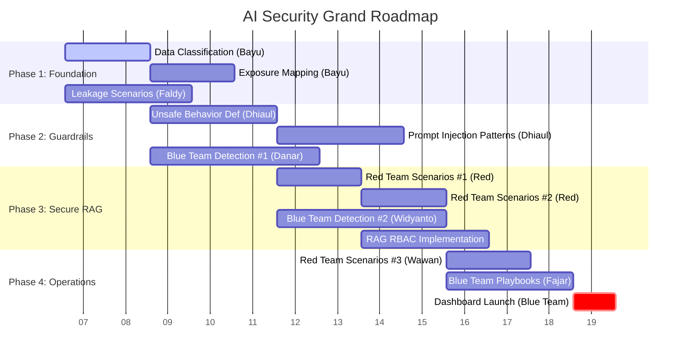

# Grand Roadmap: AI Security & Assurance

> **Vision**: Establishing AI as a Critical Information Infrastructure (CII) with National System Assurance.
> **Goal**: Digital Resilience = Security + Resilience + Public Trust.

## 1. Organization & Roles

| Role | Key PICs | Primary Responsibilities |
| :--- | :--- | :--- |
| **Security Engineer (Infra)** | **Bayu Priyanta** | Infrastructure hardening, endpoint inventory, exposure mapping, classification implementation. |
| **AI Security Engineer** | **Dhiaul ma'ruf** | Runtime guardrails, prompt injection Defense, unsafe behavior definitions. |
| **Data Governance** | **Faldy Maulana** | Data leakage scenarios, classification frameworks, policy alignment (PDPL). |
| **Red Team (Offensive)** | **Wawan, Dicky** | Adversarial simulation, scenario engineering (OWASP Top 10), penetration testing. |
| **Blue Team (Defensive)** | **Danar, Fajar, Widyanto** | Detection engineering, SOC integration, incident response, monitoring dashboards. |
| **Project Lead** | *(Anggy Edo)* | Overall strategy, roadmap alignment, stakeholder management. |

---

## 2. Strategic Phases & Timeline (Estimated)

*Based on verified backlog and strategic architecture. Timelines are estimated in Sprints (2 weeks per Sprint).*

### 🛑 Phase 1: Foundation & Discovery (Sprint 1-2)
**Focus**: Establish baselines, classify data, and map the attack surface.

| ID | Category | Initiative | PIC | Status |
| :--- | :--- | :--- | :--- | :--- |
| **#1** | **Governance** | **Classify Data Sensitivity Level** Define Public/Internal/Confidential levels. Map AI use cases to sensitivity. | Bayu Priyanta | 🟡 To Do |
| **#2** | **Infra Sec** | **Identify Internal vs External Exposure** Inventory all AI APIs. Map DNS/Firewall exposure. Assign risk ratings. | Bayu Priyanta | 🟡 To Do |
| **#5** | **Governance** | **Define Data Leakage Scenarios** Document RAG leakage, model memorization, and efficient mitigations. | Faldy Maulana | 🟡 To Do |
| **TBD**| **Architecture**| **Baseline Architecture Review** Review current deployment against "Telkom AI Infra Hardening" checklist. | Bayu / Anggy | ⚪ Planned |

### 🛡️ Phase 2: Runtime Guardrails & Control Plane (Sprint 3-5)
**Focus**: Implement active protection mechanisms (Gateway, Input/Output barriers).

| ID | Category | Initiative | PIC | Status |
| :--- | :--- | :--- | :--- | :--- |
| **#3** | **AI Sec** | **Define Unsafe AI Behavior** Categorize ethical/legal violations. Define detection thresholds. | Dhiaul ma'ruf | 🟡 To Do |
| **#4** | **AI Sec** | **Define Prompt Injection Patterns** Build regex/keyword libraries for injection detection. Integ. with Apilogy. | Dhiaul ma'ruf | 🟡 To Do |
| **#9** | **Blue Team** | **Detection & Response Capability #1** Map OWASP Top 10 to preventive controls and detection rules. | Danar Panjalu | 🟡 To Do |
| **TBD**| **Eng** | **Apilogy Gateway Integration** Implement centralized auth, rate limiting, and traffic routing for AI models. | *Dev Team* | ⚪ Planned |

### 🧠 Phase 3: Secure RAG & Advanced Defense (Sprint 6-8)
**Focus**: Deepen security for retrieval systems and specific LLM attack vectors.

| ID | Category | Initiative | PIC | Status |
| :--- | :--- | :--- | :--- | :--- |
| **#6** | **Red Team** | **Security Scenario Design #1 (Injection/Disclosure)** Simulate Prompts Injection, Sensitive Info Disclosure, Supply Chain attacks. | Red Team | 🟡 To Do |
| **#7** | **Red Team** | **Security Scenario Design #2 (Output/Agency)** Simulate Improper Output Handling, Excessive Agency, System Prompt Leakage. | Red Team | 🟡 To Do |
| **#10**| **Blue Team**| **Detection & Response Capability #2** Implement log schemas and detection rules for RAG-specific attacks. | Widyanto | 🟡 To Do |
| **TBD**| **Governance**| **RAG Role-Based Access Control (RBAC)** Enforce strict document-level access control in Vector DB. | Faldy / Bayu | ⚪ Planned |

### 👁️ Phase 4: Continuous Assurance & Operations (Sprint 9+)
**Focus**: Operationalize security with dashboards, SOPs, and automated testing.

| ID | Category | Initiative | PIC | Status |
| :--- | :--- | :--- | :--- | :--- |
| **#8** | **Red Team** | **Security Scenario Design #3 (Misinfo/DoS)** Simulate Misinformation and Unbounded Consumption (DoS) attacks. | Wawan H. | 🟡 To Do |
| **#11**| **Blue Team**| **Detection & Response Capability #3** Finalize Severity Mapping and Alert Routing strategy. | Danar | 🟡 To Do |
| **#12**| **Blue Team**| **Detection & Response Capability #4 (Playbooks)** Draft and validate AI Incident Response SOPs/Playbooks. | Fajar Eko | 🟡 To Do |
| **TBD**| **Ops** | **AI Security Dashboard** Launch Datadog dashboard for real-time AI security metrics. | Blue Team | ⚪ Planned |

---

## 3. High-Level Timeline Visualization

## 4. Key Success Metrics (OKRs)

1.  **Coverage**: 100% of AI Endpoints classified and monitored.
2.  **Detection**: ≥80% of Red Team scenarios detected by Blue Team rules.
3.  **Response**: AI Incident Response Playbook validated via Tabletop Exercise.
4.  **Compliance**: Alignment with **OWASP Top 10 for LLM** and **ISO 42001** readiness.
