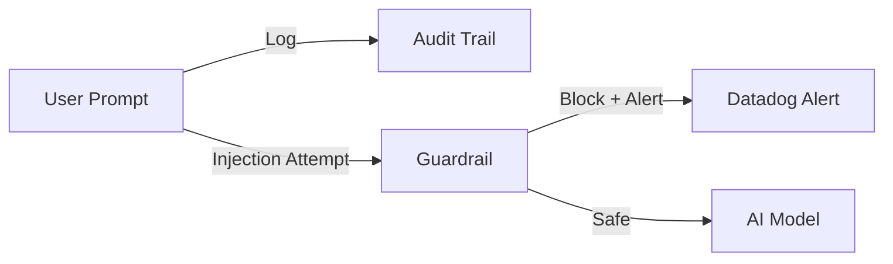

# AI Security Baseline (v0.1)

## 1. Introduction
This document defines the **minimum security controls** required for any AI service deployed within the Digital Product Division (DDP).

## 2. Access Control (Identity & Authentication)

| Control                  | Requirement                                                                                                  | Rationale                                                             |
| :----------------------- | :----------------------------------------------------------------------------------------------------------- | :-------------------------------------------------------------------- |
| **Single Control Plane** | ALL AI model access must go through the **Apilogy** gateway. Direct access to model endpoints is `PROHIBITED`. | Ensures centralized visibility, logging, and policy enforcement.      |
| **API Keys**             | Keys must be rotated every **90 days**. Hardcoded keys in code are `STRICTLY FORBIDDEN`.                         | Reduces the impact of credential leakage.                             |
| **RAG Access**           | Access restricted based on **"Need to Know"**. `RBAC` must be implemented for document retrieval.                | Prevents unauthorized users from retrieving sensitive documents via AI.|

## 3. Data Protection (Input/Output Security)

### 3.1. Data Classification Schema
All data fed into AI models must be classified:

| Level            | Description                                | Example                           | Guardrail Action      |
| :--------------- | :----------------------------------------- | :-------------------------------- | :-------------------- |
| **Public**       | Non-sensitive information                  | Public marketing copy             | Monitor Only          |
| **Internal**     | Employee-only information                  | Internal wikis                    | Monitor Only          |
| **Confidential** | Business sensitive                         | Financial reports, Strategy       | **Redact/Tokenize**   |
| **Restricted**   | Critical/Regulated PII                     | NIK, Credit Card, Medical         | **BLOCK**             |

### 3.2. Implementation Requirements
*   **PII Stripping**: Confidential PII (NIK, Phone Numbers, Financial Data) must be redacted or tokenized *before* sending to external LLMs.
*   **Grade 1 Guardrails**: Basic input validation to reject common prompt injection patterns (e.g., "Ignore previous instructions").

## 4. Monitoring & Logging

*   **Audit Trails**: All prompts and completions must be logged (excluding PII) for audit purposes.
*   **Alerting**: High-confidence security events (e.g., repeated injection attempts) must trigger an **immediate alert** in **Datadog**.

## 5. Development Lifecycle

| Phase            | Requirement                                                                 | Owner                           |
| :--------------- | :-------------------------------------------------------------------------- | :------------------------------ |
| **Development**  | **Security Testing**: No AI feature goes to production without a sign-off.    | Red Team (Dicky, Syarif, Wawan) |
| **Deployment**   | **Model Card**: Document limitations, bias testing results, and intended use. | AI Engineers                    |
