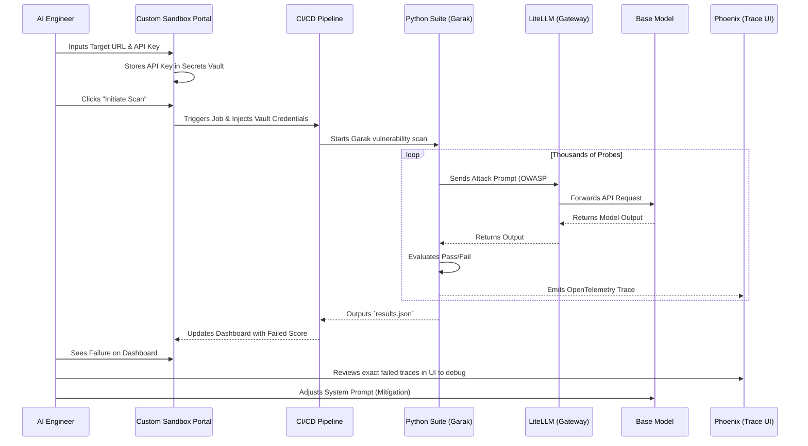
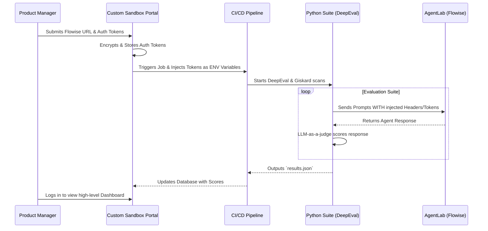
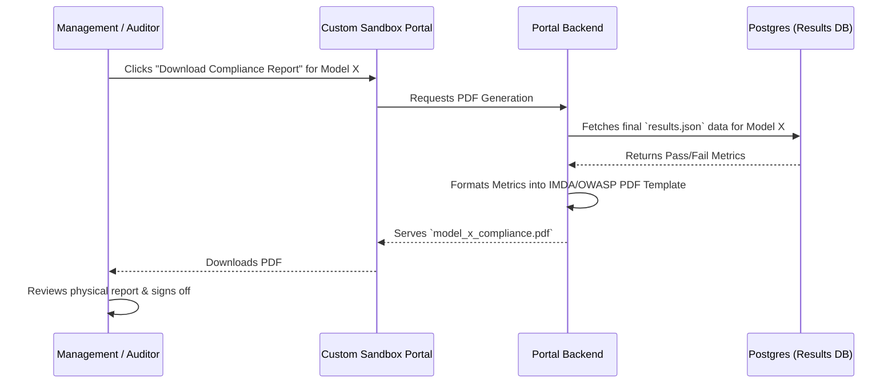
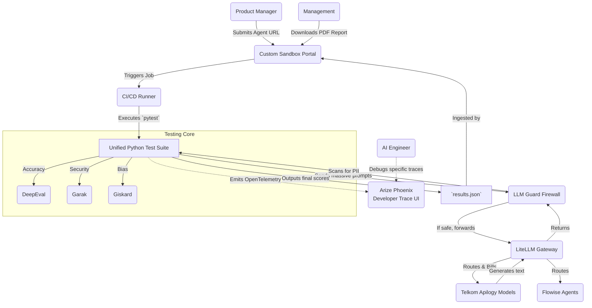

# National AI Sandbox: User Journeys & System Flow

This document outlines the detailed user journeys and system interactions for the three primary personas interacting with the National AI Sandbox. 

It maps the exact flow of data from the moment a model is submitted to the moment it receives official compliance certification, utilizing the **Unified Python Stack** (LiteLLM, DeepEval, Garak, LLM Guard) and the **Custom Sandbox Portal**.

---

## Persona 1: The AI Engineer (Model/Infrastructure Owner)

**Profile**: Highly technical. Responsible for deploying the raw Foundation Models (e.g., Qwen 30B) inside the Apilogy marketplace and ensuring they are resilient against direct adversarial attacks.
**Primary Interface**: Custom Sandbox Portal (Web UI), Developer Trace UI (Phoenix).

### The Journey
1. **Registration & Credential Setup**: The Engineer deploys a new LLM to the internal network. They log into the **Custom Sandbox Portal** and register the target model:
    *   **Endpoint URL**: e.g., `https://internal-apilogy.telkom.co.id/v1/chat/completions`
    *   **Authentication**: The Engineer enters the API Key. The Portal securely stores this in a Backend Secrets Manager (e.g., HashiCorp Vault or AWS Secrets).
    *   **Gateway Binding**: The Portal automatically configures LiteLLM to proxy this route.
2. **Automated Testing**: With a single click of "Initiate Baseline Scan" in the Portal, the backend CI/CD pipeline fetches the API key from the Vault. It spins up the Python Suite (`garak` and `deepeval`), directing thousands of probes at the new model via the LiteLLM proxy.
3. **High-Level Review**: The test finishes. The Engineer looks at the Custom Portal dashboard and sees the model failed several OWASP Prompt Injection tests.
4. **Deep Debugging**: To figure out *why*, the Engineer opens **Arize Phoenix** (running locally) to look at the raw OpenTelemetry traces. They see the exact JSON payload and the specific injection phrase that bypassed the model's system prompt.
5. **Mitigation**: The Engineer updates the model's system prompt or adds a blocking rule to **LLM Guard**, and clicks "Re-Test" in the portal.

### User-System Flow (AI Engineer)

---

## Persona 2: The Product Manager (AI App Builder)

**Profile**: Non-technical or semi-technical. Builds AI features (e.g., an HR specific Chatbot) using visual builders like Flowise. They need to get their specific "Agent" certified for employee use without writing Python code.
**Primary Interface**: Custom Sandbox Portal (Web UI).

### The Journey
1. **Agent Creation**: The PM finishes building their HR Chatbot in Flowise. It has a specific API endpoint.
2. **Submission & Header Config**: The PM logs into the **Custom Sandbox Portal**. They click "New Certification Request" and provide the Agent's details:
    *   **Flowise API URL**: e.g., `https://flowise.internal/api/v1/prediction/hr-bot`
    *   **Custom Headers/Keys**: If the Flowise agent requires a Bearer token or specific Headers (e.g., `Authorization: Bearer <token>`, or `X-User-Role: HR`), the PM inputs these into the Portal. The Portal encrypts and saves them securely.
3. **Automated Testing**: Behind the scenes, the portal triggers the Sandbox CI/CD pipeline. The pipeline pulls the secure tokens and securely passes them down into the Unified Python Stack (DeepEval & Giskard) environment variables. The Python tests hit the Flowise endpoint mimicking a real, authenticated user. The PM safely closes their laptop.
4. **Reviewing Results**: The next day, the PM logs back into the Custom Sandbox Portal. They do not see raw JSON or telemetry traces. They see a clean Dashboard for their "HR Chatbot":
    *   **Contextual Relevancy**: 92% (Green)
    *   **Toxicity**: 0% (Green)
    *   **OWASP Vulnerabilities**: 1 found (Yellow)
5. **Action**: The dashboard tells the PM in plain English that their bot leaked a dummy social security number during the test. The PM goes back to Flowise to adjust their instructions and clicks "Re-Test" in the portal.

### User-System Flow (Product Manager)

---

## Persona 3: Management / Government Auditor

**Profile**: Executive or Compliance Auditor. Needs absolute certainty that deployed models meet internal safety guidelines and external government frameworks (IMDA/EU AI Act/OWASP) before public release.
**Primary Interface**: Static PDF Reports (Generated from the Portal).

### The Journey
1. **The Audit Request**: Management is preparing to launch the HR Chatbot company-wide. They need to sign the official risk acceptance form.
2. **Accessing the Hub**: They log into the **Custom Sandbox Portal** and view the "Certified Models" list.
3. **Generating the Receipt**: They find the "HR Chatbot v2.1" which shows all Green dials. They click the **"Download Compliance Report"** button.
4. **The Artifact**: The portal instantly generates a formal, stamped PDF. This PDF contains no code. It explicitly lists the testing parameters: "Tested with 5,000 OWASP Probes: 0% Jailbreak Success." It lists the Data Privacy checks verified by LLM Guard.
5. **Sign-Off**: Management attaches this PDF to the final Jira ticket or compliance folder and approves the production launch with a clear audit trail.

### User-System Flow (Management/Auditor)

---

## Complete Unified End-to-End System Flow

This diagram shows how all components interact when triggered from the Custom Portal.

